# Adding a Package

## Overview

Entry-point workflow for adding any software package to the Bluefin image. Choose the right element kind, create the element, wire it into the build, and validate.

## Choose Element Kind

```dot
digraph choose_kind {
    "What are you packaging?" [shape=diamond];
    "Pre-built binary/tarball" [shape=box];
    "Source with Meson build" [shape=box];
    "Source with Makefile" [shape=box];
    "Source with autotools" [shape=box];
    "Source with CMake" [shape=box];
    "Rust/Cargo project" [shape=box];
    "Go project" [shape=box];
    "Config files only" [shape=box];
    "Dependency group" [shape=box];

    "What are you packaging?" -> "Pre-built binary/tarball" [label="no build needed"];
    "What are you packaging?" -> "Source with Meson build" [label="meson.build exists"];
    "What are you packaging?" -> "Source with Makefile" [label="Makefile exists"];
    "What are you packaging?" -> "Source with autotools" [label="configure.ac exists"];
    "What are you packaging?" -> "Source with CMake" [label="CMakeLists.txt exists"];
    "What are you packaging?" -> "Rust/Cargo project" [label="Cargo.toml exists"];
    "What are you packaging?" -> "Go project" [label="go.mod exists"];
    "What are you packaging?" -> "Config files only" [label="just files to install"];
    "What are you packaging?" -> "Dependency group" [label="aggregate other elements"];

    "manual kind + tar/remote source" [shape=ellipse];
    "meson kind" [shape=ellipse];
    "make kind" [shape=ellipse];
    "autotools kind" [shape=ellipse];
    "cmake kind" [shape=ellipse];
    "cargo kind + cargo2 sources" [shape=ellipse];
    "manual kind (see note)" [shape=ellipse];
    "import kind" [shape=ellipse];
    "stack kind" [shape=ellipse];

    "Pre-built binary/tarball" -> "manual kind + tar/remote source";
    "Source with Meson build" -> "meson kind";
    "Source with Makefile" -> "make kind";
    "Source with autotools" -> "autotools kind";
    "Source with CMake" -> "cmake kind";
    "Rust/Cargo project" -> "cargo kind + cargo2 sources";
    "Go project" -> "manual kind (see note)";
    "Config files only" -> "import kind";
    "Dependency group" -> "stack kind";
}
```



**Go projects:** Most common approach is `make` kind with vendored deps. See "Not Yet Documented" section.

**Pre-built binaries:** **REQUIRED SUB-SKILL:** Use superpowers:packaging-pre-built-binaries for multi-arch dispatch, `strip-binaries`, and source patterns.

## Workflow

1. **Create element** at `elements/bluefin/<name>.bst`
2. **Add to deps** -- add `bluefin/<name>.bst` to the `depends:` list in `elements/bluefin/deps.bst`
3. **Add source alias** -- if the download domain is new, add an alias to `include/aliases.yml` (file aliases for tarballs, git aliases for repos)
4. **Validate** -- `just bst show bluefin/<name>.bst`
5. **Build element** -- `just bst build bluefin/<name>.bst`
6. **Full image test** -- `just build` or `just show-me-the-future`

**REQUIRED SUB-SKILL:** Use superpowers:local-e2e-testing for build commands and troubleshooting.

## Systemd Service Installation

Services bundled with a package need three things:

| What | Where | Notes |
|---|---|---|
| Service file | `%{indep-libdir}/systemd/system/` (= `/usr/lib/systemd/system/`) | Patch `/usr/sbin` to `/usr/bin`; remove `EnvironmentFile=/etc/default/*` lines |
| Preset file | `%{indep-libdir}/systemd/system-preset/80-<name>.preset` | Content: `enable <service-name>.service` |
| Binaries | `%{bindir}` (= `/usr/bin`) | Never `/usr/sbin` -- GNOME OS uses merged-usr |

Enable services via preset files, never `systemctl enable`. Example from Tailscale:

```yaml
install-commands:
  - |
    sed -e 's|/usr/sbin/tailscaled|/usr/bin/tailscaled|g' \
        -e '/^EnvironmentFile=/d' \
        systemd/tailscaled.service > tailscaled.service.patched
    install -Dm644 -t "%{install-root}%{indep-libdir}/systemd/system" tailscaled.service.patched
    mv "%{install-root}%{indep-libdir}/systemd/system/tailscaled.service.patched" \
       "%{install-root}%{indep-libdir}/systemd/system/tailscaled.service"
  - |
    install -Dm644 /dev/stdin "%{install-root}%{indep-libdir}/systemd/system-preset/80-tailscale.preset" <<'PRESET'
    enable tailscaled.service
    PRESET
```

## Common Mistakes

| Mistake | Fix |
|---|---|
| Missing `strip-binaries: ""` | Required for non-ELF elements (fonts, configs, pre-built binaries) -- build fails otherwise |
| Using `/usr/sbin` | Always `/usr/bin` -- GNOME OS merged-usr |
| `EnvironmentFile=/etc/default/...` | GNOME OS doesn't use `/etc/default/`; remove these lines from upstream service files |
| Variables in source URLs | BuildStream doesn't support this; use literal URLs with aliases |
| Missing `%{install-extra}` | Must be last install-command -- handles license files and metadata |
| Forgot to add element to `deps.bst` | Element builds but won't be included in the image |
| Wrong dependency stack | Use `freedesktop-sdk.bst:public-stacks/runtime-minimal.bst` for runtime deps; `buildsystem-*` stacks for build-deps |

## Not Yet Documented

Future skills needed for:

- **Packaging Go projects** -- three approaches: `make` with vendored deps, `manual` with `go_module` sources, `manual` with `go_build` plugin
- **Packaging Rust/Cargo projects** -- `cargo` kind, `cargo2` sources, offline vendor caching
- **OCI layer composition** -- how `elements/oci/layers/` assembles the final image
- **Patching upstream junctions** -- adding patches to freedesktop-sdk or gnome-build-meta
- **Removing packages from the build** -- safely unwiring elements and cleaning up
