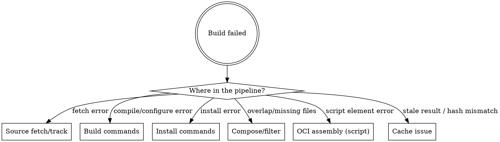

# Debugging BuildStream Build Failures

## Overview

Systematic guide for diagnosing and fixing BuildStream build failures in the bluefin-egg project. Covers all failure categories from source fetching through OCI assembly, plus CI-specific debugging.

## Quick Reference

| Command | Purpose |
|---|---|
| `just bst artifact log <element>` | View build log for a built/failed element |
| `just bst shell --build <element>` | Interactive shell inside build sandbox |
| `just bst show <element>` | Inspect resolved deps, variables, commands |
| `just bst source fetch <element>` | Fetch sources (test network/URL issues) |
| `just bst source track <element>` | Update source ref to latest upstream |
| `just bst artifact delete <element>` | Delete cached artifact (fix stale cache) |
| `just bst build <element>` | Build a single element in isolation |

## Diagnostic Flowchart

**Step 1:** Read the error. BuildStream prints the failing element name and phase.
**Step 2:** Run `just bst artifact log <element>` to get the full log.
**Step 3:** Match to a category below.

## Failure Categories

### 1. Source Fetch Failures

**Symptoms:** `Failed to fetch`, `Connection refused`, `404 Not Found`, `ref not found`, `Could not find base directory matching pattern`

| Cause | Fix |
|---|---|
| Wrong URL or expired link | Check source URL; update alias in `include/aliases.yml` if domain changed |
| Wrong git ref / tag deleted | Run `just bst source track <element>` to update ref |
| Network issue / GNOME CAS down | Retry; check connectivity to `gbm.gnome.org:11003` |
| Missing source alias | Add alias to `include/aliases.yml` (see `buildstream-element-reference` skill) |
| Tarball checksum mismatch | Source was updated without updating ref; `bst source track` to get new hash |
| Tarball has no wrapping directory | Add `base-dir: ""` to the `tar` source. Common with Go binary releases (e.g., fzf ships a bare binary). See `buildstream-element-reference` skill for `base-dir` docs. |

**Debug command:** `just bst source fetch <element>` -- isolates fetch from build.

### 2. Build Command Failures

**Symptoms:** `configure failed`, `compilation error`, `command not found`, `missing header`

| Cause | Fix |
|---|---|
| Missing build dependency | Add dep to `build-depends:` -- use `just bst show <element>` to check current deps |
| Wrong configure flags | Check upstream docs; inspect with `just bst show <element>` to see resolved variables |
| Sandbox restriction (no network) | BuildStream sandboxes have no network at build time; vendor deps or use source elements |
| Missing build tool | Ensure the right `buildsystem-*` stack or tool element is in `build-depends:` |

**Debug command:** `just bst shell --build <element>` -- drops you into the sandbox with all build-deps staged. Run commands manually to isolate the failure.

### 3. Install Command Failures

**Symptoms:** `No such file or directory`, `Permission denied`, `install: cannot create`

| Cause | Fix |
|---|---|
| Missing `%{install-root}` prefix | All install paths MUST start with `%{install-root}` |
| Target directory doesn't exist | Add `install -d "%{install-root}%{prefix}/..."` before copying files |
| Wrong path variable | Use `%{bindir}`, `%{datadir}`, `%{indep-libdir}` -- see `buildstream-element-reference` |
| Using `/usr/sbin` | GNOME OS uses merged-usr -- always `/usr/bin` |
| Missing `%{install-extra}` | Should be last install-command (convention, not fatal) |

**Debug command:** `just bst shell --build <element>` -- then manually run install commands to see exact error.

### 4. Compose/Filter Failures

**Symptoms:** `overlap error`, files missing from final image, `FAILED: ... file already exists`

| Cause | Fix |
|---|---|
| File overlap between elements | Add `public.bst.overlap-whitelist` to the overriding element |
| Files in excluded split domain | Don't install to `/usr/include/`, `/usr/lib/debug/`, `/usr/share/doc/` unless intended |
| Package not in image despite building | Ensure element is in `bluefin/deps.bst` depends list |
| Missing `strip-binaries: ""` | Required for non-ELF elements (fonts, configs, pre-built binaries) -- strip fails on non-ELF |

**Debug steps:**
1. `just bst show oci/layers/bluefin.bst` -- check compose config, exclude lists
2. `just bst artifact checkout <element> --directory /tmp/inspect` -- inspect what the element actually installs
3. See `oci-layer-composition` skill for the full filter chain

### 5. Cache Corruption / Stale Artifacts

**Symptoms:** Build succeeds but produces wrong output, element shows as `cached` but content is outdated, hash mismatch errors

| Cause | Fix |
|---|---|
| Element source changed but artifact cached | `just bst artifact delete <element>` then rebuild |
| Dependency changed but downstream cached | Delete the downstream element's artifact too |
| CAS corruption (rare) | `rm -rf ~/.cache/buildstream/artifacts` -- nuclear option, forces full rebuild |
| R2 cache has stale artifact | CI-only; stale R2 artifacts are overwritten on next main push |

**Key insight:** BuildStream's cache keys include all dependencies. If you change a source ref but the element still shows `cached`, either the ref change didn't take effect or there's a junction caching issue. Run `just bst show <element>` and check `Keys:` -- if the key matches the old build, the source change wasn't picked up.

### 6. Junction / Upstream Failures

**Symptoms:** `Element not found in junction`, `Failed to resolve`, errors in freedesktop-sdk or gnome-build-meta elements

| Cause | Fix |
|---|---|
| Junction ref points to broken upstream commit | Update ref in `freedesktop-sdk.bst` or `gnome-build-meta.bst` |
| Patch no longer applies cleanly | Update patch in `patches/` directory to match new upstream |
| Override element path changed upstream | Update `config.overrides` in the junction element |

**Debug:** `just bst show <junction>:<element>` -- shows resolved element through the junction.

## CI-Specific Debugging

### Reading CI Logs

CI uploads two artifacts on every run (including failures):

| Artifact | Contents |
|---|---|
| `buildstream-logs` | Full BuildStream build log (`logs/build.log`) |
| `bazel-remote-logs` | Cache proxy log (`/tmp/bazel-remote.log`) |

Download from the GitHub Actions run page > Artifacts section.

### `on-error: continue`

CI uses `on-error: continue` in `buildstream-ci.conf`. This means:
- BuildStream does **not** stop at the first failure
- It builds everything it can, skipping elements whose deps failed
- The build log contains **ALL** failures, not just the first
- Search the log for `FAILURE` to find every failing element

### CI-Specific Failure Modes

| Symptom | Cause | Fix |
|---|---|---|
| Build OOM-killed | `builders: 1` but element needs >7GB RAM | Reduce `max-jobs` for that element via `variables: { max-jobs: 1 }` |
| Disk space exhaustion | BuildStream CAS fills the runner | Check `Disk space before/after build` steps; `cache-buildtrees: never` should already be set |
| Cache proxy unreachable | `bazel-remote` failed to start | Check `bazel-remote-logs` artifact; verify R2 secrets are configured |
| Artifact push fails | R2 auth issue or proxy died mid-build | Non-fatal (`continue-on-error: true`); check proxy logs |
| Source cache miss on PR | PR builds don't write to R2 cache | Expected; PR builds pull from GNOME upstream + R2 read-only |
| `--no-interactive` prompt | Element needs user input | Fix the element; CI runs `--no-interactive` and will hang/fail |

### Cache Proxy Debugging

The `bazel-remote` proxy bridges BuildStream gRPC CAS to Cloudflare R2:
- HTTP status: `curl http://localhost:8080/status` (from runner host)
- gRPC CAS: `grpc://localhost:9092` (BuildStream connects here)
- Logs: `/tmp/bazel-remote.log`

If artifacts aren't being cached: check the proxy log for S3/R2 auth errors. The proxy config uses `type: storage` (not `index`) -- without this, BuildStream silently ignores the remote.

## General Debugging Workflow

1. **Identify the failing element** -- BuildStream names it in the error output
2. **Read the log** -- `just bst artifact log <element>` (or download CI artifact)
3. **Classify the failure** -- match to a category above
4. **Inspect the element** -- `just bst show <element>` for deps, variables, commands
5. **Reproduce interactively** -- `just bst shell --build <element>` to run commands by hand
6. **Fix and rebuild** -- edit the `.bst` file, `just bst build <element>`
7. **Clear cache if needed** -- `just bst artifact delete <element>` before rebuilding

## Related Skills

- `local-e2e-testing` -- running builds locally, prerequisites, environment variables
- `buildstream-element-reference` -- variable names, element kinds, source kinds
- `oci-layer-composition` -- how packages flow into the final image, compose filtering
- `adding-a-package` -- end-to-end workflow for new packages
- `patching-upstream-junctions` -- fixing upstream element issues via patches
