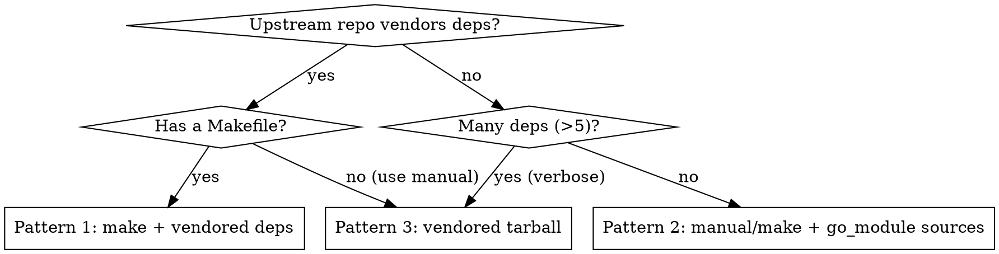

# Packaging Go Projects

## Overview

Go projects in BuildStream use one of three patterns for offline dependency handling. The sandbox has no network access, so Go modules must be pre-staged. The Go compiler is provided by `freedesktop-sdk.bst:components/go.bst` (NOT `golang.bst`).

## When to Use

- Project has a `go.mod` and builds with `go build` or `make`
- You need to vendor Go module dependencies for offline builds
- You're adding a Go binary to the image

## Pattern Selection



## Common Go Build Environment

All Go elements share these settings:

```yaml
variables:
  optimize-debug: "false"     # Go has its own optimization; BST defaults interfere
  ldflags_defaults: ""         # Disable BST default linker flags that conflict with Go
  strip-binaries: ""           # Go static binaries aren't standard ELF; don't strip

environment:
  GOARCH: "%{go-arch}"         # Maps to amd64/arm64/riscv64 (defined in project.conf)
```

| Variable/Env | Purpose |
|---|---|
| `optimize-debug: "false"` | Prevents BST debug optimization flags conflicting with Go |
| `ldflags_defaults: ""` | Prevents BST default linker flags conflicting with Go's linker |
| `strip-binaries: ""` | Go static binaries use their own symbol format; `strip(1)` breaks them |
| `%{go-arch}` | Architecture mapping: x86_64->amd64, aarch64->arm64, riscv64->riscv64 |
| `MAKEFLAGS: -j1` | For `make` kind -- Go parallelizes internally, don't add make-level parallelism |

## Pattern 1: make + Vendored Deps (GOPATH Layout)

Use when the upstream project vendors dependencies in its git repo and has a Makefile. Most common pattern (podman, skopeo, conmon).

**Key trick:** Clone the git repo into a GOPATH-style directory using `directory:` on the source, then set `GOPATH` to the build root.

```yaml
kind: make

build-depends:
  - freedesktop-sdk.bst:components/go.bst
  - freedesktop-sdk.bst:components/go-md2man.bst  # if project has man pages
  - freedesktop-sdk.bst:public-stacks/buildsystem-make.bst

depends:
  - freedesktop-sdk.bst:public-stacks/runtime-minimal.bst

environment:
  GOPATH: "%{build-root}"
  MAKEFLAGS: -j1

variables:
  ldflags_defaults: ""
  optimize-debug: "false"
  command-subdir: src/github.com/<org>/<repo>

sources:
  - kind: git_repo
    url: github:<org>/<repo>.git
    directory: src/github.com/<org>/<repo>
    track: v*
    ref: <git-describe-ref>
```

**Critical details:**
- `directory: src/github.com/<org>/<repo>` stages the source into the GOPATH layout
- `command-subdir` tells BuildStream to run commands from within that directory
- `GOPATH: "%{build-root}"` makes Go find the vendored deps at the right path
- `MAKEFLAGS: -j1` prevents make from adding parallelism (Go handles it internally)

## Pattern 2: manual/make + go_module Sources

Use when the upstream project doesn't vendor dependencies. Each Go module gets a `go_module` source entry. Best for projects with few dependencies (<30).

```yaml
kind: manual

build-depends:
  - freedesktop-sdk.bst:components/go.bst
  - freedesktop-sdk.bst:components/gcc.bst        # if CGO is needed
  - freedesktop-sdk.bst:components/stripper.bst    # if CGO is needed

depends:
  - freedesktop-sdk.bst:public-stacks/runtime-minimal.bst

variables:
  optimize-debug: "false"

config:
  build-commands:
    - go build -mod=vendor

  install-commands:
    - install -Dm755 <binary> -t "%{install-root}%{bindir}"
    - "%{install-extra}"

sources:
  - kind: git_repo
    url: github:<org>/<repo>.git
    track: v*
    ref: <git-describe-ref>

  # One entry per Go module dependency
  - kind: go_module
    url: github:<module-repo>.git
    module: github.com/<org>/<module>
    ref:
      go-version: <version>
      git-ref: <version-tag>-0-g<commit>
      explicit: True

  # ... more go_module entries
```

**go_module source format:**
```yaml
- kind: go_module
  url: github:<owner>/<repo>.git
  module: github.com/<owner>/<repo>       # Full Go module path
  ref:
    go-version: v2.1.0                     # Version from go.sum
    git-ref: v2.1.0-0-g<commit-hash>      # Git describe format
    explicit: True
```

### modules.txt Workaround

Some projects need a `vendor/modules.txt` file that isn't generated by `go_module` staging. Add it as a `local` source and move it in `build-commands`:

```yaml
sources:
  - kind: git_repo
    url: github:<org>/<repo>.git
    track: v*
    ref: <ref>
  - kind: local
    path: files/<project>/modules.txt
  - kind: go_module
    ...

config:
  build-commands:
    (<):
      - mv -vf modules.txt vendor/modules.txt
```

The `(<):` syntax prepends to default build-commands. Store `modules.txt` in `files/<project>/` in the repo.

### Hybrid: make + go_module

The `make` kind can also use `go_module` sources (see fscrypt.bst). Use this when the project has a Makefile but doesn't vendor deps:

```yaml
kind: make

build-depends:
  - freedesktop-sdk.bst:components/go.bst
  - freedesktop-sdk.bst:public-stacks/buildsystem-make.bst

sources:
  - kind: git_repo
    url: github:<org>/<repo>.git
    track: v*
    ref: <ref>
  - kind: local
    path: files/<project>/modules.txt
  - kind: go_module
    ...

config:
  build-commands:
    (<):
      - mv -vf modules.txt vendor/modules.txt
```

## Pattern 3: Vendored Tarball

Use when a vendored tarball already exists (upstream releases it) or when the number of `go_module` entries would be impractical. The tarball includes `vendor/` pre-populated.

```yaml
kind: manual      # or meson/autotools if the project uses those

build-depends:
  - freedesktop-sdk.bst:components/go.bst
  - freedesktop-sdk.bst:public-stacks/buildsystem-make.bst

depends:
  - freedesktop-sdk.bst:public-stacks/runtime-minimal.bst

environment:
  GOFLAGS: "-mod=vendor"

variables:
  optimize-debug: "false"
  ldflags_defaults: ""
  strip-binaries: ""

config:
  build-commands:
    - go build -o <binary> .

  install-commands:
    - install -Dm755 <binary> -t "%{install-root}%{bindir}"
    - "%{install-extra}"

sources:
  - kind: tar
    url: github_files:<org>/<repo>/releases/download/<version>/<project>-<version>-vendored.tar.xz
    ref: <sha256>
```

Some upstream projects publish vendored tarballs (e.g., toolbox). If not, generate one:
```bash
git clone --branch <version> https://github.com/<org>/<repo>
cd <repo> && go mod vendor
tar czf <project>-<version>-vendor.tar.gz vendor/
```

### Simplest Vendored Pattern

When the git repo itself contains a `vendor/` directory and you don't need make:

```yaml
kind: manual

build-depends:
  - freedesktop-sdk.bst:components/go.bst

depends:
  - freedesktop-sdk.bst:public-stacks/runtime-minimal.bst

config:
  build-commands:
    - go build ./cmd/<binary>

  install-commands:
    - install -Dt "%{install-root}%{bindir}" -m755 <binary>

sources:
  - kind: git_repo
    url: github:<org>/<repo>.git
    track: v*
    ref: <ref>
```

No GOPATH tricks needed when the repo vendors deps and you use `kind: manual`.

## CGO Considerations

| Scenario | CGO_ENABLED | Extra Build-Deps |
|---|---|---|
| Pure Go binary (no C deps) | `0` | None |
| Links to C libraries (PAM, libseccomp, etc.) | `1` (default) | `gcc.bst`, `stripper.bst`, library build-deps |
| Static binary with C deps | Use `-extldflags '-static'` | Same as above + static libs |

Example CGO build flags:
```yaml
environment:
  CGO_ENABLED: "1"

config:
  build-commands:
    - go build -buildmode=pie -ldflags "-s -linkmode external -extldflags '$LDFLAGS'"
```

## Dependency Tracking

Go elements in freedesktop-sdk (podman, skopeo, bootc's go-md2man dep) are tracked by upstream. If you add a Go element to `elements/bluefin/` or `elements/core/`:
- `git_repo` sources can be added to `.github/workflows/track-bst-sources.yml`
- `go_module` sources are NOT auto-tracked -- updates require manual `bst source track`
- Vendored tarballs need manual updates when upstream releases new versions

## Common Mistakes

| Mistake | Symptom | Fix |
|---|---|---|
| Using `components/golang.bst` | Element not found | Correct path: `components/go.bst` |
| Missing `GOPATH` for Pattern 1 | `cannot find package` errors | Set `GOPATH: "%{build-root}"` and use `directory:` on git_repo |
| Missing `command-subdir` for Pattern 1 | Build runs from wrong directory | Set `command-subdir: src/github.com/<org>/<repo>` |
| Not setting `MAKEFLAGS: -j1` | Resource exhaustion, flaky builds | Go parallelizes internally; don't add make parallelism |
| Missing `ldflags_defaults: ""` | Linker errors from conflicting flags | Set `ldflags_defaults: ""` in variables |
| Missing `strip-binaries: ""` | Go binary stripped, stack traces broken | Set `strip-binaries: ""` -- Go binaries use their own symbol format |
| Listing 100+ go_module entries | Works but unmaintainable | Switch to Pattern 3 (vendored tarball) |
| Missing `modules.txt` with go_module | `go build -mod=vendor` fails | Add `modules.txt` as `local` source, move to `vendor/` |

## Real Examples

All Go elements are in the freedesktop-sdk junction (none in project elements/ yet):
- **Pattern 1 (make + vendored):** `components/podman.bst`, `components/skopeo.bst`, `components/conmon.bst`
- **Pattern 2 (go_module):** `components/go-md2man.bst` (1 module), `components/git-lfs.bst` (33 modules), `components/fscrypt.bst` (15 modules, make+go_module hybrid)
- **Pattern 3 (vendored tarball):** `gnomeos-deps/toolbox.bst` (meson), `gnomeos-deps/nvidia-container-toolkit.bst` (manual, simplest)
