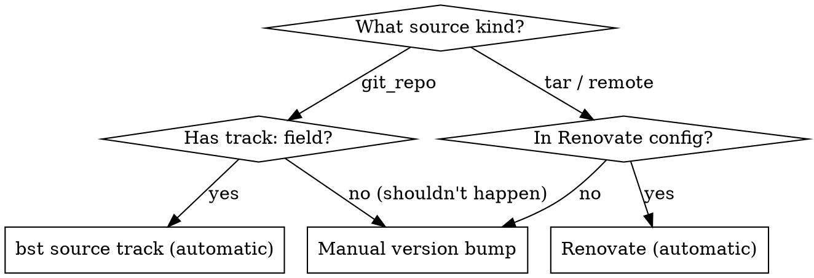

# Updating Upstream Refs

## Overview

Three mechanisms track upstream dependency versions in this project. Which one applies depends on the source kind in the `.bst` element. Most packages are handled automatically -- manual intervention is only needed for `tar`/`remote` sources without Renovate coverage.

## When to Use

- Upstream released a new version and you need to update the image
- You want to know if a package updates automatically or needs manual work
- You're adding a new package and need to wire it into the right tracking mechanism
- A tracking PR failed or looks wrong

## Decision Tree



**Quick check:** Open the `.bst` file. If first source is `kind: git_repo` with a `track:` field, it's handled by `bst source track`. If it's `kind: tar` or `kind: remote`, check `.github/renovate.json5` for a matching regex pattern. If neither applies, it's manual.

## The Three Mechanisms

### 1. `bst source track` Workflow

**How it works:** `bst source track <element>` reads the `track:` field (a branch name or tag glob like `v*` or `main`), queries the upstream git remote for the latest matching ref, and updates the `ref:` field in the `.bst` file.

**Only works for `git_repo` sources.** Does NOT work for `tar`, `remote`, or other kinds.

**CI workflow:** `.github/workflows/track-bst-sources.yml` runs daily and on manual dispatch.

| Group | Elements | PR behavior |
|---|---|---|
| **auto-merge** | brew, common, jetbrains-mono, 6 shell extensions, build-oci-rs | Squash-merged automatically |
| **manual-merge** | gnome-build-meta, freedesktop-sdk, grub, ptyxis, efibootmgr | PR created, requires human review |
| **tarballs** | brew-tarball, wallpapers | Custom bash script checks GitHub Releases API, updates URL + SHA256 |

**Run locally:**

```bash
just bst source track elements/bluefin/brew.bst
just bst source track elements/gnome-build-meta.bst
```

**What `track:` values look like:**

| Pattern | Meaning | Example element |
|---|---|---|
| `main` | Latest commit on main branch | `brew.bst`, `common.bst` |
| `master` | Latest commit on master branch | `gnome-build-meta.bst` |
| `v*` | Latest tag matching `v*` glob | `app-indicators.bst` |
| `freedesktop-sdk-25.08*` | Latest tag matching pattern | `freedesktop-sdk.bst` |
| `<commit-hash>` | Pinned — tracking is a no-op | (avoid this pattern) |

### 2. Renovate

**How it works:** Renovate's custom regex managers in `.github/renovate.json5` match URL + ref patterns in specific files and check upstream registries for new versions.

**What Renovate tracks:**

| Package | Datasource | Files matched |
|---|---|---|
| bst2 container image | Docker registry | `build-egg.yml`, `track-bst-sources.yml`, `Justfile` |
| bazel-remote binary | GitHub Releases | `build-egg.yml` |
| BuildStream plugins | PyPI | `elements/plugins/*.bst` |
| Nerd Fonts (JetBrainsMono) | GitHub Releases | `elements/bluefin/jetbrains-mono-nerd-font.bst` |
| GitHub Actions | Built-in manager | `.github/workflows/*.yml` |

Renovate creates PRs automatically. Patch updates for CI tooling auto-merge; BuildStream plugins and Nerd Fonts require review.

### 3. Manual Version Bump

For packages with `tar` or `remote` sources that aren't covered by Renovate or the tarball-tracking job.

## Manual Version Bump Workflow

**When:** Updating Tailscale, Zig, or any `tar`/`remote` source not in the other two mechanisms.

### Simple case (single tar source, e.g., Tailscale)

1. Find the new version's download URL from the upstream release page
2. Download and compute SHA256:
   ```bash
   curl -fsSL "https://example.com/pkg-v2.0.0-amd64.tgz" | sha256sum
   ```
3. Edit the `.bst` file -- update `url:` with new version and `ref:` with new SHA256:
   ```yaml
   sources:
     - kind: tar
       url: github_files:tailscale/tailscale/releases/download/v2.0.0/tailscale_2.0.0_amd64.tgz
       ref: <new-sha256>
   ```
4. **Repeat for each architecture** (e.g., `tailscale-x86_64.bst` AND `tailscale-aarch64.bst`)
5. Build the element:
   ```bash
   just bst build elements/bluefin/tailscale-x86_64.bst
   ```
6. Full image build to verify:
   ```bash
   just build
   ```
7. Commit: `chore(deps): update tailscale to v2.0.0`

## Adding New Packages to Tracking

### To `bst source track` (git_repo sources)

The element just needs a `track:` field -- `bst source track` reads it automatically. To add it to the CI workflow:

1. Edit `.github/workflows/track-bst-sources.yml`
2. Add the element path to the appropriate matrix group's `elements:` list
3. Choose `auto-merge` for low-risk elements, `manual-merge` for junctions and core components

### To the tarball tracking job

1. Add a new section in the `track-tarballs` job's "Check for tarball updates" step
2. Use `gh api` to query the GitHub Releases API for the latest release tag
3. Use `sed` to update the URL and `ref` in the `.bst` file
4. The job already handles PR creation for all tarball changes together

### To Renovate

1. Add a new `customManagers` entry in `.github/renovate.json5`
2. Write a regex with named capture groups: `depName`, `currentValue`, `currentDigest`
3. Specify the `datasourceTemplate` (github-releases, pypi, docker, etc.)
4. Add `packageRules` if you want auto-merge or grouping behavior

Renovate regex must match the URL + ref as a **multi-line pair** (URL line followed by ref line). Example pattern from the Nerd Fonts manager:

```
url:\s*github_files:(?<depName>ryanoasis/nerd-fonts)/releases/download/v(?<currentValue>\d+\.\d+\.\d+)/JetBrainsMono\.tar\.xz\n\s+ref:\s*(?<currentDigest>[a-f0-9]{64})
```

## What's NOT Tracked (Manual Only)

| Package | Source kind | Why not automated |
|---|---|---|
| Tailscale (x86_64 + aarch64) | `tar` | No `track:` field; not in Renovate |
| Zig compiler | `tar` | Pre-built binary; not in Renovate |

These require manual version bumps following the workflow above.

## Common Mistakes

| Mistake | Fix |
|---|---|
| Confusing `track:` with `ref:` | `track:` is the branch/tag pattern to follow; `ref:` is the pinned commit/hash. `bst source track` updates `ref:` based on `track:` |
| Forgetting a per-arch element | Tailscale has separate x86_64 and aarch64 elements -- update both |
| Running `bst source track` on a `tar` element | It silently does nothing. `bst source track` only works on `git_repo` sources |
| Stale SHA256 after URL change | Always recompute: `curl -fsSL <url> \| sha256sum` |
| Editing `ref:` in a junction without testing | Junction ref changes (gnome-build-meta, freedesktop-sdk) can break hundreds of downstream elements. Always `just build` |

## Cross-References

- `adding-a-package` -- creating new elements
- `packaging-pre-built-binaries` -- multi-arch tar patterns (relevant to manual bumps)
- `local-e2e-testing` -- build commands and troubleshooting
- `patching-upstream-junctions` -- when a junction update requires new patches
